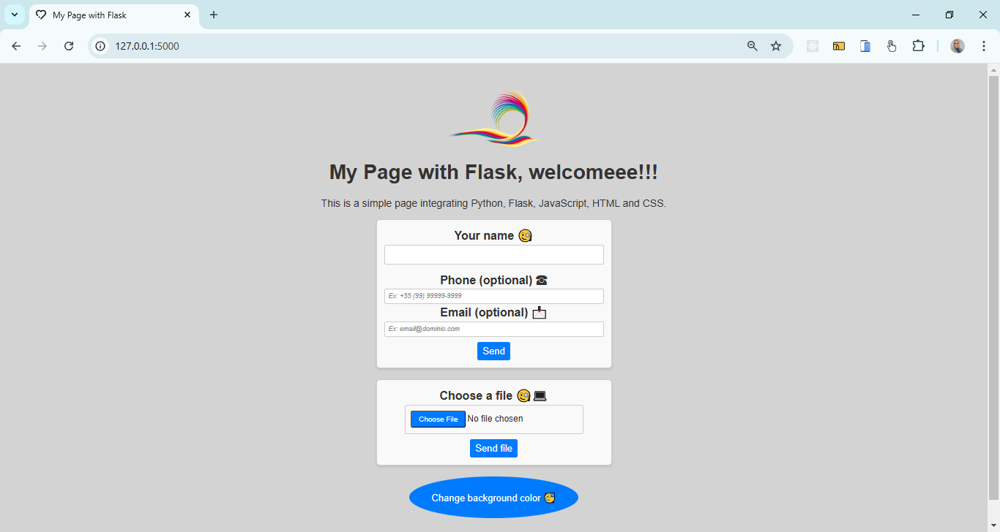
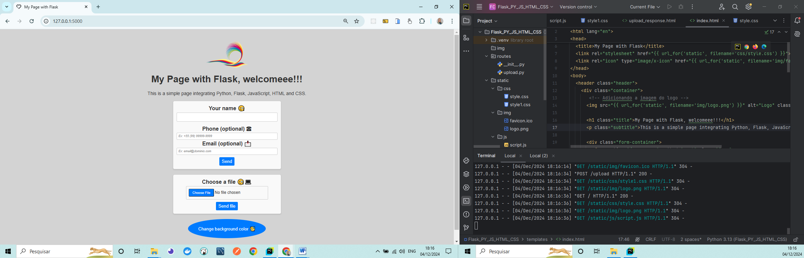
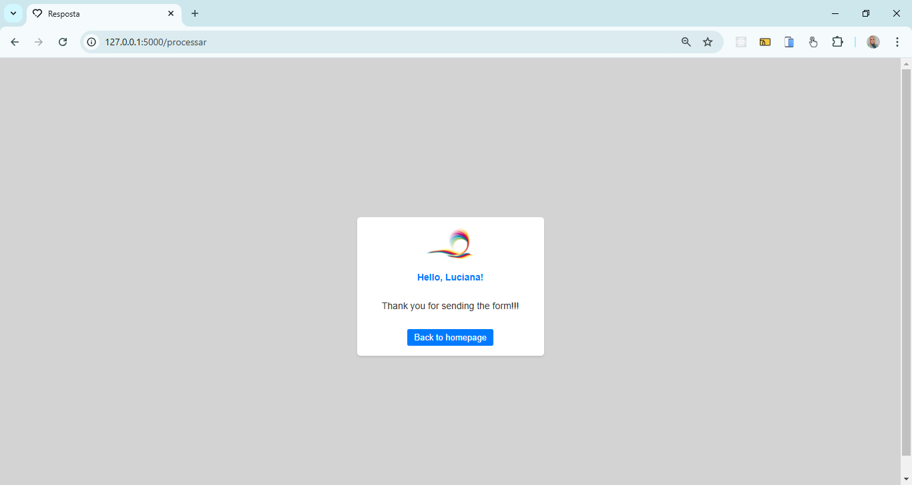
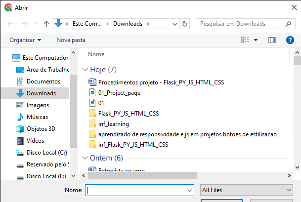
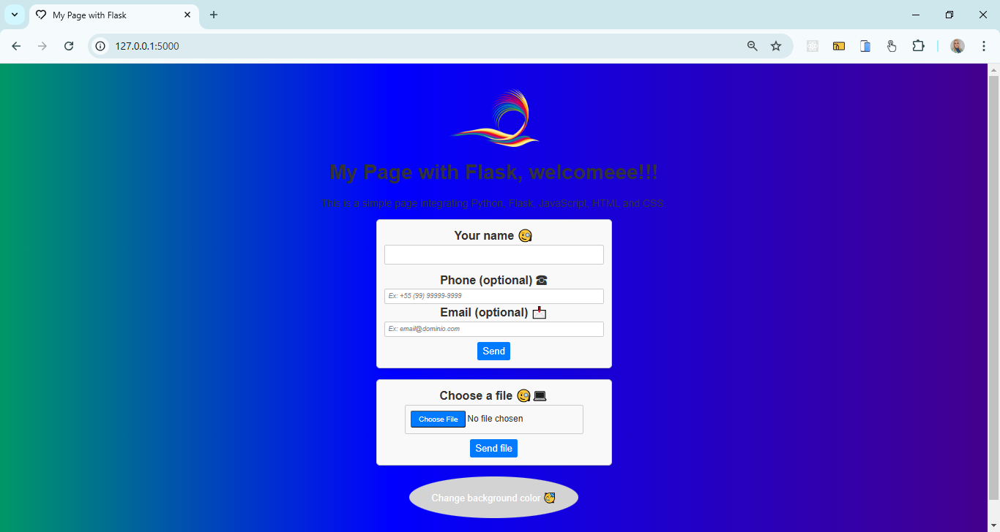
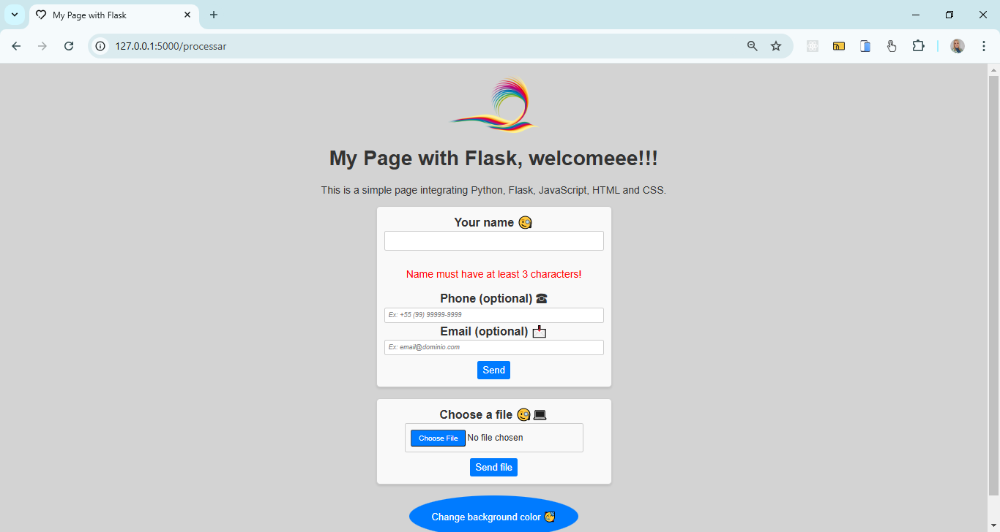
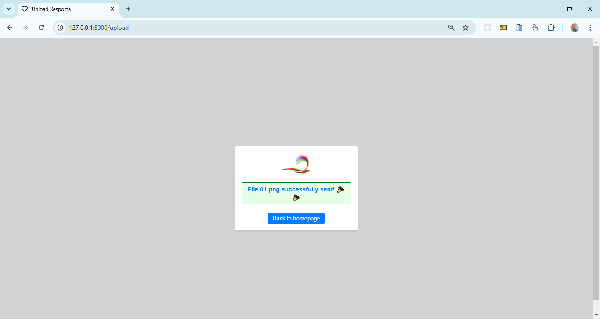

## Flask_PY_JS_HTML_CSS
 - Web Integration Project with Flask, HTML, CSS, and JavaScript
 - This project integrates Flask (Python) with HTML, CSS, and JavaScript to create a functional and interactive web application. The app allows users to submit a form with personal information and upload files. The project demonstrates how to create interactive forms, process data, and use Flask for routing and dynamic templating.

---

<h4 align="center">Web - Flask_PY_JS_HTML_CSS 🚀</h4>

    <table>
        <tr>
            <td style="width: 50%; text-align: center;">
                
                
Flask_PY_JS_HTML_CSS_app.py

            </td>
            <td style="width: 50%; text-align: center;">
                
                
Project_page_Codig

            </td>
        </tr>
    </table>

   
   

    <table>
        <tr>
            <td style="width: 50%; text-align: center;">
                
                
Name_pag_route_proc

            </td>
            <td style="width: 50%; text-align: center;">
                
                
Page_upload

            </td>
        </tr>
    </table>

   
   

  

    <table>
        <tr>
            <td style="width: 50%; text-align: center;">
                
                
Color_Flask_PY_JS_HTML_CSS_app.py

            </td>
            <td style="width: 50%; text-align: center;">
                
                
Teste_name_erro

            </td>
        </tr>
    </table>

   
   

  

    <table>
        <tr>
            <td style="width: 50%; text-align: center;">
                
                
Page_ok_upload

            </td>          
        </tr>
    </table>

   
   
  
---

#### Features
 - Interactive Form: Users can fill out a form with name, phone number, and email.
 - File Upload: Users can upload files with allowed types such as images and text files.
 - Data Validation: The name validation ensures it has at least 3 characters, while the file validation ensures only allowed file types are uploaded.
 - Dynamic Color Effect: JavaScript is used to change the page background color with an interactive rainbow gradient.
 - Modular Structure: The code is split into separate files using Blueprints in Flask, making the application more maintainable and organized.

#### Technologies Used
 - Python (Flask): Web framework used for the backend of the application.
 - JavaScript: DOM manipulation and page interactivity, including the color-changing effect.
 - HTML: Structuring and layout of the web application.
 - CSS (with Flexbox and Grids): Styling the application, including responsiveness.
 - Werkzeug: Used to ensure that file names are secure when uploading.

- #### My LinkedIn - 

#### Contact

#### [**Luciana Diemert**](https://github.com/ludiemert)

🛠 Full-Stack Developer  
🖥️ Python Enthusiast | Computer Vision | AI Integrations  
📍 São Jose dos Campos – SP, Brazil

&nbsp;
&nbsp;
&nbsp;
&nbsp;

 
